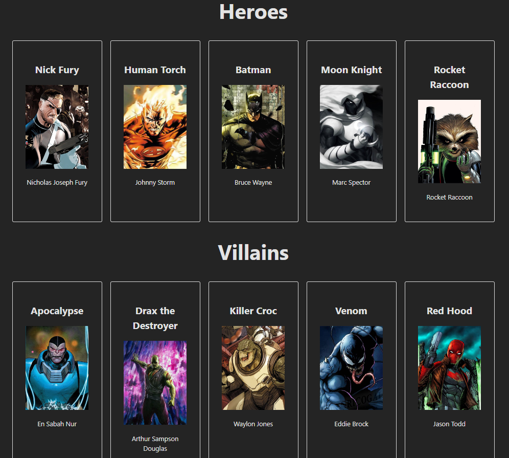

## ACC Software Bootcamp
## Assessment #2

### INSTRUCTIONS:

1.  Git clone this `Students_Oct_2023_Reviews` repository to your computer, within your "Bootcamp" folder. Do not clone it INSIDE an existing git repository.

    - You can run the command `ls -a` to ensure you are not currently in a repository.  If you are in a repo, you would see a `.git` folder in it. You should not clone a repository within a repository since that will cause issues pushing your work up to Github. Find a folder (e.g. Bootcamp or Desktop) and clone it there.

2.  Copy the `Assessment_2` folder over to your repo, so you can edit the contents there and commit/push them for grading.

    For example, get the questions from

    `https://github.com/ACCSoftwareBootcamp/Students_Oct_2023_Reviews/Assessment_2`

    And push your answers to

    `https://github.com/ACCSoftwareBootcamp/<YOUR_REPO>/Assessment_2`

## MULTIPLE CHOICE QUESTIONS

30% of Assessment 2 is based on the multiple choice questions below.

https://forms.gle/E9q9CyxzNZ5ruxzx8

## PRACTICAL

70% of Assessment 2 is based on this exercise below.

This exercise is designed to test your knowledge of the front end as well as how to consume an external API while using React. We have provided the Server handling the API calls here. However, it doesn't work as expected due to a number of bugs. Based on your in class coding experience, find and fix the bugs and recreate the React frontend shown in the image below.  

Notes: 

- Do not just re-write the Server route(s), but fix the bugs in the provided code.

- Each bug-fix change should have meaningful comments (no auto generatation from ChatGPT, Tabnine, Github Copilot, etc.).

- The app uses the Superhero API. https://superheroapi.com/.  Read over the documentation and familiarize yourself with how to use it.

- The page should display the names, full-names, and images of 5 hero and 5 villain characters of your choice. (Displayed results should be all 10 of the provided Superhero characters). The page should have some resemblence to the image above, it does not need to be perfect. 

- You must utilize state, props and parent/child component(s).

- Fetching on the frontend should include a comma-separated list in the ids query parameter. For example `GET /team?ids=1,2,3,4,5`

- Add comments to the existing code. You should use your own words and explain what each block of code is for.

## TIME AVAILABLE

1. You have till 1:00 PM on the test day to complete the assessment, unless you have made prior accommodation with the Instructor.

1. You should be able to complete the assessment in under 4 hours. Remember to take breaks, as needed.

## INTEGRITY:

Remember this review is a test of how well prepared you are. You need an honest answer. So, please try to satisfy the spirit of the assessment. It is more important to learn from this experience, than to bypass it. As such, here are some ground rules

Absolutely no

- sharing of direct or indirect answers, between students.
- sharing of answer code.
- sharing of screens.
- copying of wholesale code from any online resource. Make this your own work, even if referring to other projects.

 Any clarification from instructors should be posted on Slack under the channel **#assessments** such that all students have access to the same clarification.

The instructors may ask you to explain your work over a Zoom meeting, if the submission is not complete or if it appears to be not your work.