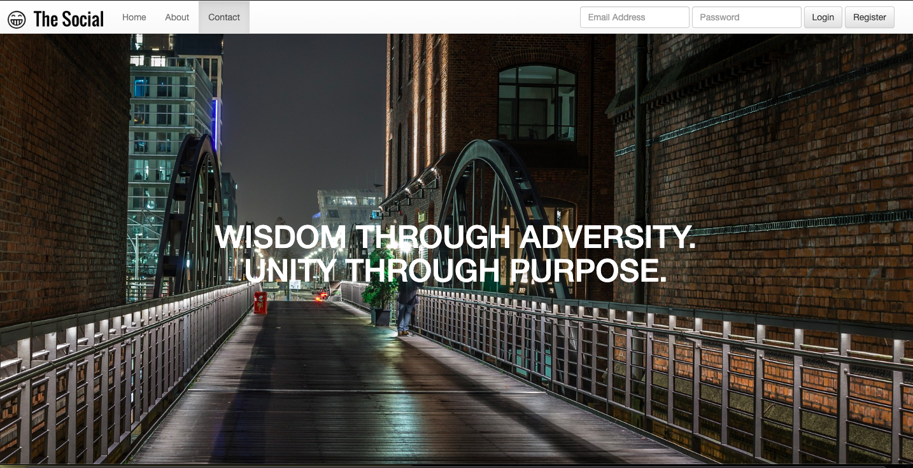

## In-Class Exercise: The Social

**A website with three web pages for a fictional social network called 'The Social'.**

There is a home page, an about page, and a contact page. Each page has a navigation bar and footer. (NOTE: the screenshot for the home page does not show a footer BUT please make sure to add a footer that is the same as the about and contact page footers.)

On the about page: the columns in the middle section should remain side by side on large, extra large and extra extra large screen sizes. The columns should stack on top of each other on an extra small, small and medium screen.

On the contact page: the columns for the form field and the text need to be side by side on large, extra large and extra extra large screens, and then stack on top of each other when it's viewed on an extra small, small and medium.

The footer (on all pages) should have its columns side by side on all sizes, except for extra small and small. 

Screenshots:

**Home page** 

**About page (one continuous page)**

**Contact page (one continuous page)**

#### Demo:

The above working pages have been demo'ed here:

[YouTube](https://youtu.be/c99-BL8ow-E)

**NOTE:** Ignore the clock in the background - You will get to do this when we study JavaScript  :)

Steps to get started:

1. Do a `git pull` while in your local `Students_Oct_2023` repo. This will bring the new starter code down to your computer.

1. Copy the `theSocial` folder into your `StudentRepo/Bootstrap` folder.

1. You will be given the remaining classtime to finish this.

1. Refer to documentation and ask for help if needed.

1. A solution will be posted later today in `Students_Oct_2023/90_Starter_Code/Bootstrap`.